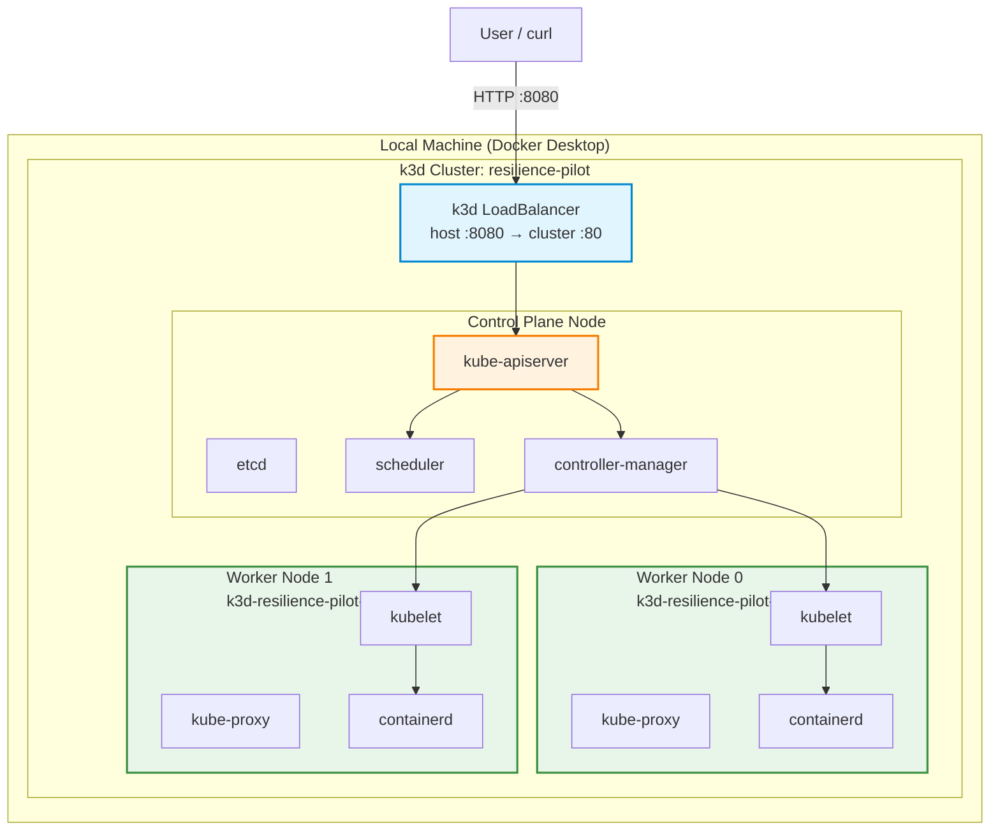
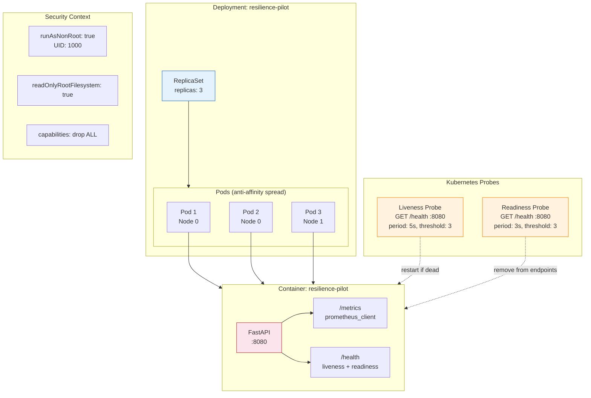
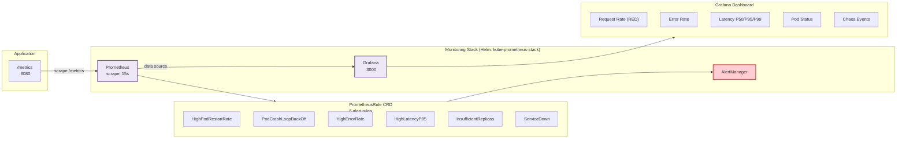
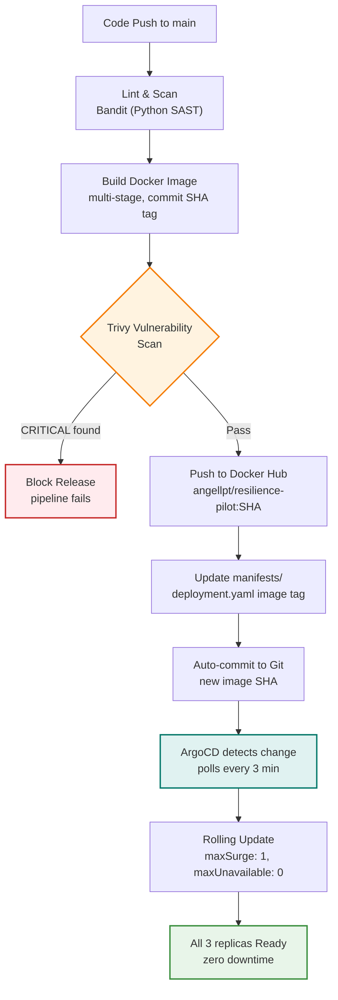
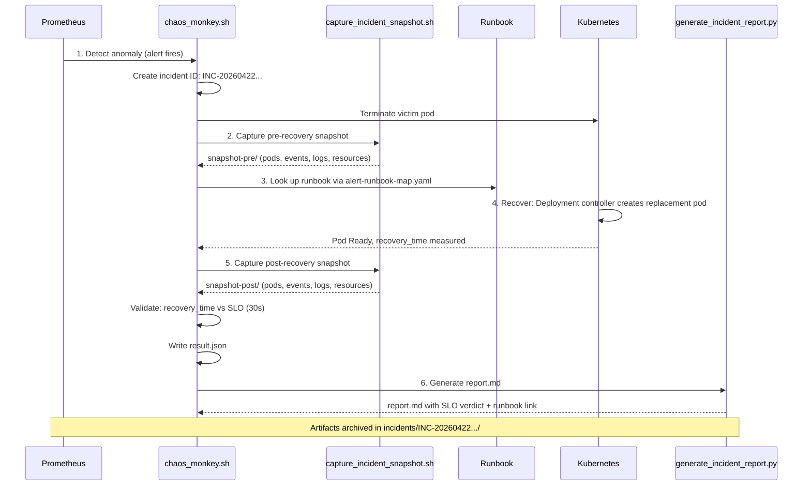
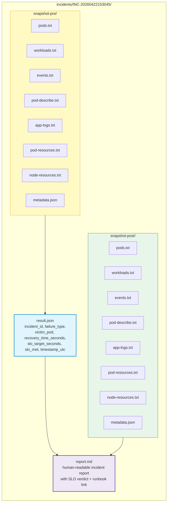
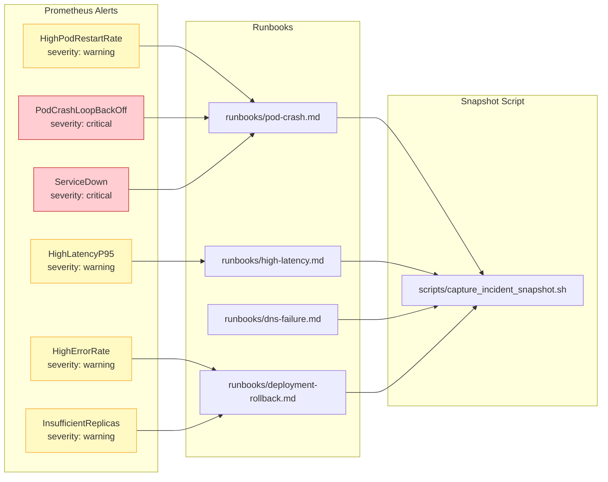
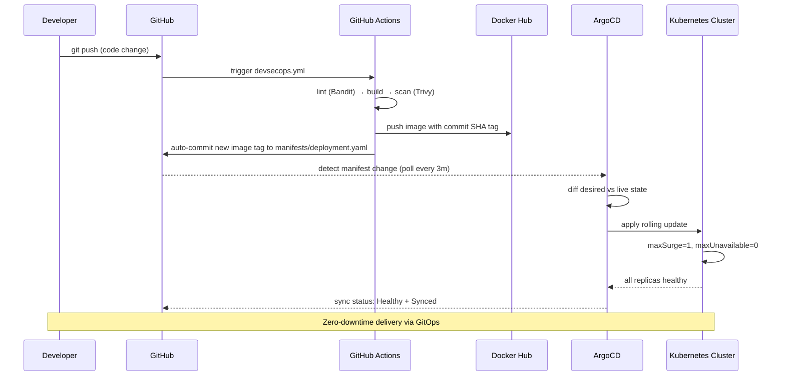
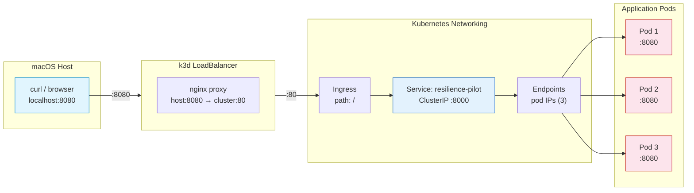
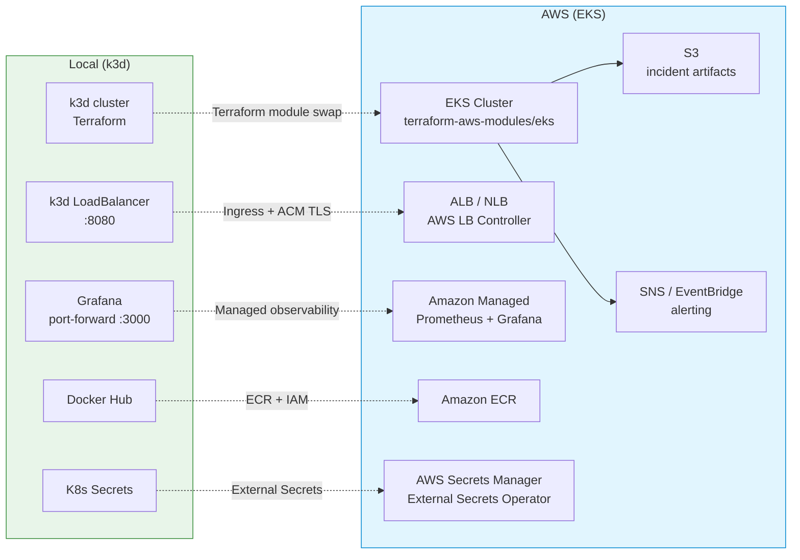

# Architecture

Full system architecture for the Kubernetes Reliability Platform. All diagrams use Mermaid.js.

---

## Table of Contents

1. [Cluster Topology](#cluster-topology)
2. [Application Stack](#application-stack)
3. [Observability Pipeline](#observability-pipeline)
4. [CI/CD Pipeline](#cicd-pipeline)
5. [Closed-Loop Incident Workflow](#closed-loop-incident-workflow)
6. [Incident Artifact Flow](#incident-artifact-flow)
7. [Alert-to-Runbook Mapping](#alert-to-runbook-mapping)
8. [GitOps Reconciliation](#gitops-reconciliation)
9. [Networking](#networking)
10. [AWS Migration Path](#aws-migration-path)

---

## Cluster Topology

Three-node k3d cluster with anti-affinity pod scheduling across worker nodes.

---

## Application Stack

FastAPI application deployed as 3 replicas with probes, anti-affinity, and Prometheus instrumentation.

---

## Observability Pipeline

Prometheus scrapes application metrics, evaluates alert rules, and feeds Grafana dashboards.

---

## CI/CD Pipeline

GitHub Actions multi-stage pipeline with shift-left security gates, feeding ArgoCD for GitOps delivery.

---

## Closed-Loop Incident Workflow

Six-phase auditable lifecycle for every chaos experiment. Each phase produces traceable artifacts.

---

## Incident Artifact Flow

Detailed view of what each phase captures and produces.

---

## Alert-to-Runbook Mapping

Six Prometheus alerts mapped to four runbooks via `monitoring/alert-runbook-map.yaml`.

---

## GitOps Reconciliation

ArgoCD watches the Git repository and reconciles cluster state with declared manifests.

---

## Networking

Traffic flow from host through k3d LoadBalancer to application pods.

---

## AWS Migration Path

Component mapping from local k3d to production EKS. See [aws-deployment-plan.md](aws-deployment-plan.md) for details.

---

## Related

- [Operational Feedback Loop](operational-feedback-loop.md) - Full incident lifecycle documentation
- [AWS Deployment Plan](aws-deployment-plan.md) - k3d to EKS migration guide
- [Pod Crash Runbook](../runbooks/pod-crash.md)
- [High Latency Runbook](../runbooks/high-latency.md)
- [DNS Failure Runbook](../runbooks/dns-failure.md)
- [Deployment Rollback Runbook](../runbooks/deployment-rollback.md)
