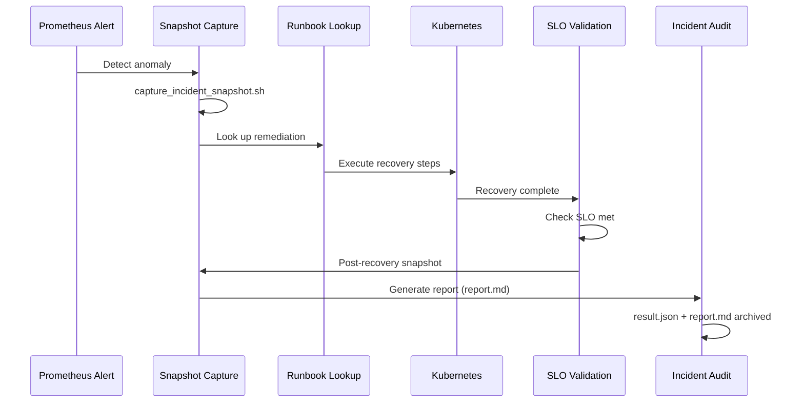

# Operational Feedback Loop

Closed-loop incident workflow: detect, snapshot, runbook, recover, validate, audit

## Workflow Sequence



## Phase Details

### 1. Detect

Prometheus alerts fire based on SLO thresholds defined in PrometheusRules. Alert annotations link to runbooks via `alert-runbook-map.yaml`. When a threshold is breached, the alert includes:

- The alert name and severity
- A link to the corresponding runbook
- Key labels (namespace, service, SLO target)

### 2. Snapshot

`scripts/capture_incident_snapshot.sh` captures cluster state into a timestamped directory under `incidents/`. The snapshot includes:

- Pod statuses across namespaces
- Recent Kubernetes events
- Application container logs
- Resource usage metrics
- Node conditions

This pre-recovery snapshot provides the baseline for post-mortem analysis.

### 3. Runbook

The operator consults the runbook linked in the alert annotation. Each runbook provides structured remediation steps:

- Immediate triage actions
- Step-by-step recovery procedure
- Verification commands
- Escalation criteria if recovery fails

Runbook bindings are defined in `alert-runbook-map.yaml`.

### 4. Recover

Kubernetes self-healing (Deployments, ReplicaSets) or manual remediation restores service to a healthy state. Recovery actions depend on the failure mode:

- Pod crashes: automatic restart via restart policy
- OOM kills: resource limit adjustment
- Node failures: rescheduling via cluster autoscaler
- Config errors: rollback via ArgoCD sync

### 5. Validate

Recovery time is measured against the SLO target (30 seconds). Validation checks:

- Pod readiness probes passing
- Application health endpoint returning 200
- Error rate below SLO threshold
- Latency within acceptable range

SLO evaluation results are recorded in `result.json`.

### 6. Audit

`scripts/generate_incident_report.py` produces `report.md` with full context for post-mortem review. The report includes:

- Incident metadata and failure context
- Pre and post recovery snapshot excerpts
- SLO evaluation results
- Runbook reference and generation timestamp

Both `result.json` and `report.md` are archived in the incident directory.

## Incident Artifacts

Each incident produces a structured directory:

```
incidents/INC-20260422153045/
├── result.json           # Machine-readable SLO evaluation
├── report.md             # Human-readable incident report
├── snapshot-pre/         # Cluster state before recovery
│   ├── pods.txt
│   ├── events.txt
│   ├── app-logs.txt
│   └── ...
└── snapshot-post/        # Cluster state after recovery
    ├── pods.txt
    ├── events.txt
    └── ...
```

- **result.json** -- Machine-readable evaluation of whether the SLO was met, including recovery duration and threshold.
- **report.md** -- Narrative incident report for human review, generated from snapshot data and SLO results.
- **snapshot-pre/** -- Cluster state captured at the moment of detection, before any recovery action.
- **snapshot-post/** -- Cluster state captured after recovery, used to confirm healthy state and compare against pre-recovery.

## Runbook Lookup

Runbook bindings are configured in `alert-runbook-map.yaml`. This file maps Prometheus alert names to runbook documents:

```yaml
alerts:
  HighErrorRate:
    runbook: runbooks/deployment-rollback.md
    severity: warning
  HighLatencyP95:
    runbook: runbooks/high-latency.md
    severity: warning
  PodCrashLoopBackOff:
    runbook: runbooks/pod-crash.md
    severity: critical
```

When an alert fires, the runbook link is included in the alert annotation. The operator follows the runbook for structured remediation rather than ad-hoc troubleshooting.

## Continuous Improvement

Incident data feeds back into SLO refinement through:

- **Recovery time tracking** -- Each incident records actual recovery time. If recovery consistently exceeds the 30-second SLO, the target or the recovery mechanism is re-evaluated.
- **Runbook updates** -- Post-mortem findings are incorporated into runbooks. If a runbook step was unclear or incomplete, it is revised.
- **Alert tuning** -- False positive and missed alert patterns are analyzed. Alert thresholds are adjusted to improve signal-to-noise ratio.
- **Chaos experiment calibration** -- Incident data informs which failure modes to simulate and at what severity, ensuring chaos experiments reflect real-world conditions.
